# Домашнее задание к занятию «Хранение в K8s. Часть 2» - Илларионов Дмитрий

### Цель задания

В тестовой среде Kubernetes нужно создать PV и продемострировать запись и хранение файлов.

------

### Чеклист готовности к домашнему заданию

1. Установленное K8s-решение (например, MicroK8S).
2. Установленный локальный kubectl.
3. Редактор YAML-файлов с подключенным GitHub-репозиторием.

------

### Дополнительные материалы для выполнения задания

1. [Инструкция по установке NFS в MicroK8S](https://microk8s.io/docs/nfs). https://microk8s.io/docs/addon-nfs
2. [Описание Persistent Volumes](https://kubernetes.io/docs/concepts/storage/persistent-volumes/). 
3. [Описание динамического провижининга](https://kubernetes.io/docs/concepts/storage/dynamic-provisioning/). 
4. [Описание Multitool](https://github.com/wbitt/Network-MultiTool).

------

### Задание 1

**Что нужно сделать**

Создать Deployment приложения, использующего локальный PV, созданный вручную.

1. Создать Deployment приложения, состоящего из контейнеров busybox и multitool.

Но, сначала я создал и преминил вольюм, потом запрос, а потом тольк деплоймент. Пока привожу код деплоймента.

```
apiVersion: apps/v1
kind: Deployment
metadata:
  name: dep-pvc-vol
  labels:
    app: dep-pvc-vol
spec:
  replicas: 1
  selector:
    matchLabels:
      app: pod-pvc-vol
  template:
    metadata:
      labels:
        app: pod-pvc-vol
    spec:
      containers:
      - name: busybox
        image: busybox
        command: ['sh', '-c', 'while true; do echo "$(date +%T)">> /output/timefile; sleep 5; done']
        volumeMounts:
        - name: pv-vol
          mountPath: /output        
      - name: multitool
        image: wbitt/network-multitool
        env:
        - name: HTTP_PORT
          value: "8080"
        - name: HTTPS_PORT
          value: "11443"
        ports:
        - containerPort: 8080
          name: http-port
        - containerPort: 11443
          name: https-port
        volumeMounts:
        - name: pv-vol
          mountPath: /input
      volumes:
      - name: pv-vol
        persistentVolumeClaim:
          claimName: pvc-vol
        # emptyDir: {}
        # hostPath:
        #   path: /var/data          
```


2. Создать PV и PVC для подключения папки на локальной ноде, которая будет использована в поде.

Код создания вольюма:

```
apiVersion: v1
kind: PersistentVolume
metadata:
  name: presist-vol
spec:
  capacity:
    storage: 10Gi
  accessModes:
  - ReadWriteOnce
  hostPath:
    path: /data/pv1
```
Код запроса:

```
apiVersion: v1
kind: PersistentVolumeClaim
metadata:
  name: pvc-vol
 # namespace: web
spec:
  # storageClassName: manual
  volumeMode: Filesystem
  accessModes:
  - ReadWriteOnce
  resources:
    requests:
      storage: 10Gi
```
Применяю:

```
kubectl apply -f presist-vol.yaml
```

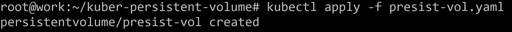

```
kubectl get pv
```

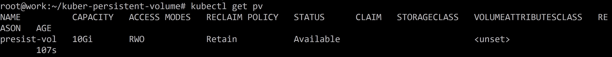

```
kubectl describe presist-vol
```

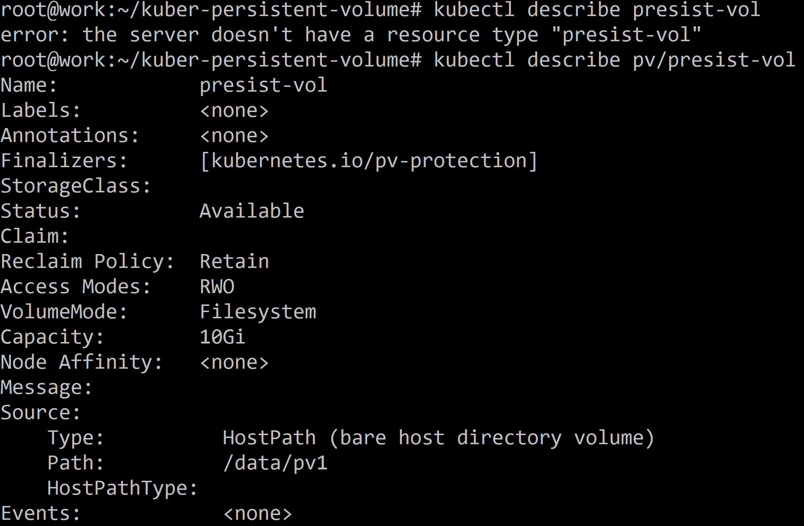

Применяю запрос вольюма:

```
kubectl apply -f pv-clame.yaml
```

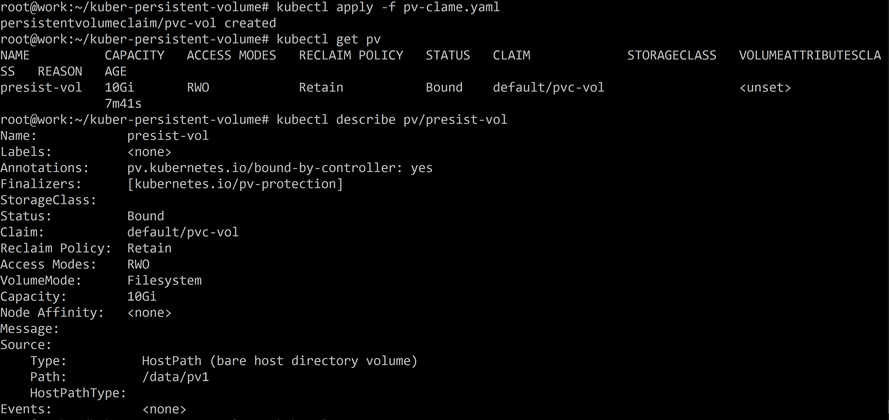


Применяю деплоймент:

```
kubectl apply -f dep-pre-vol.yaml
```

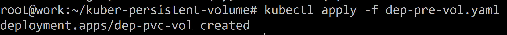

Проверяю иду на ноду кластера и смотрю файл:

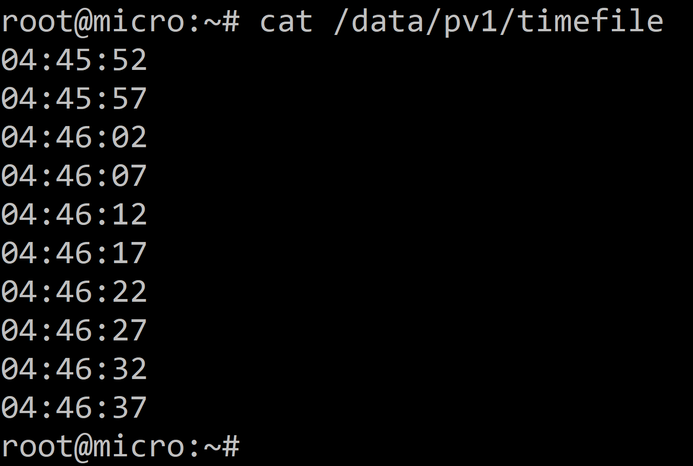

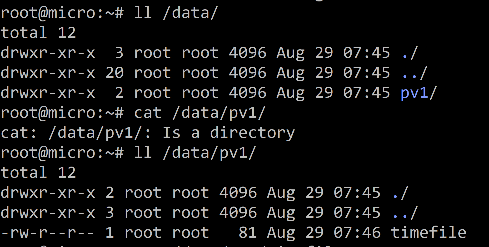

3. Продемонстрировать, что multitool может читать файл, в который busybox пишет каждые пять секунд в общей директории. 

```
kubectl get po
```


```
kubectl exec -it dep-pvc-vol-bbd45b8c-rwp6f -c multitool /bin/sh
```

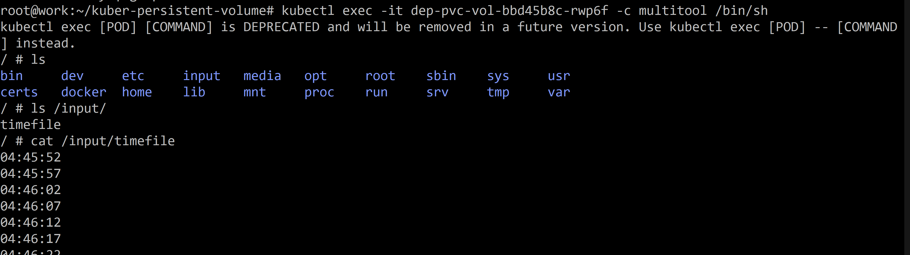

4. Удалить Deployment и PVC. Продемонстрировать, что после этого произошло с PV. Пояснить, почему.

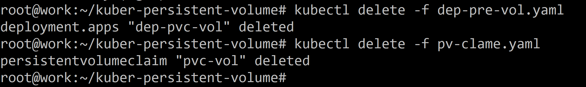

```
kubectl get pv
```
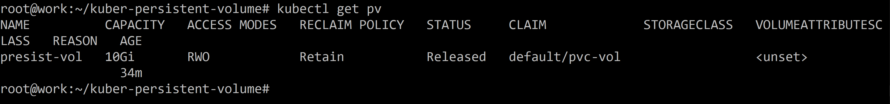

При этом сами данные в файле остались на ноде:

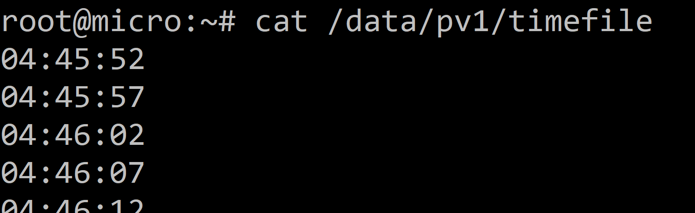

был статус bound стал - release - освобожден, т.е. не используется. Но, данные сами не удались и вольюм не удалился, т.к. политика не была указана например как 

```
persistentVolumeReclaimPolicy: Delete
```
было указано:

```
Reclaim Policy:  Retain
```
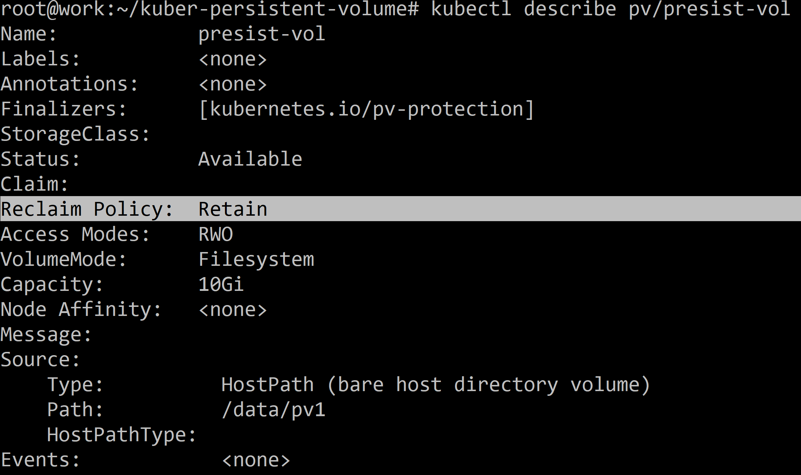

5. Продемонстрировать, что файл сохранился на локальном диске ноды. Удалить PV.  

Уже выше продемонстрировал.

Продемонстрировать что произошло с файлом после удаления PV. Пояснить, почему.

Удаляю pv:

```
kubectl delete -f presist-vol.yaml
```

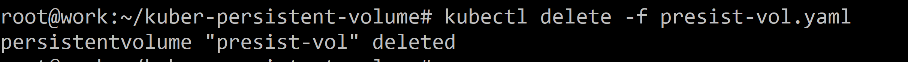

Файл остался:

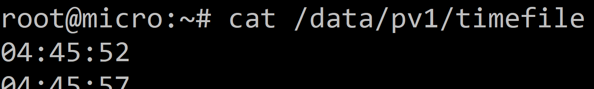

Потому что политика была:

```
Reclaim Policy:  Retain
```

5. Предоставить манифесты, а также скриншоты или вывод необходимых команд.

все показал выше.

------

### Задание 2

**Что нужно сделать**

Создать Deployment приложения, которое может хранить файлы на NFS с динамическим созданием PV.

1. Включить и настроить NFS-сервер на MicroK8S.

Выполнил на ноде:
```
apt install -y nfs-common
```

далее:

```
 microk8s enable nfs
```
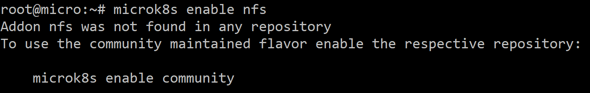

```
microk8s enable community
```
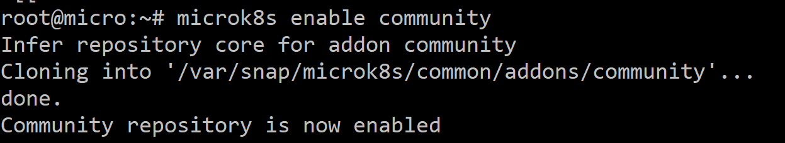

Еще раз:

```
microk8s enable nfs
```

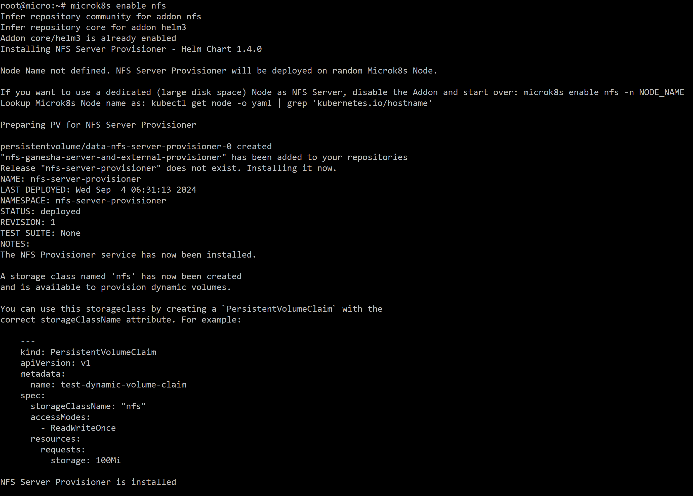

Теперь можно создавать пример:

```
    kind: PersistentVolumeClaim
    apiVersion: v1
    metadata:
      name: test-dynamic-volume-claim
    spec:
      storageClassName: "nfs"
      accessModes:
        - ReadWriteOnce
      resources:
        requests:
          storage: 100Mi
```

Проверил:

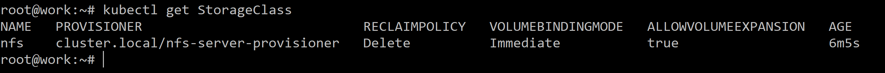

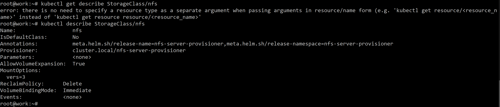

2. Создать Deployment приложения состоящего из multitool, и подключить к нему PV, созданный автоматически на сервере NFS.

Создал файлы:

```
    kind: PersistentVolumeClaim
    apiVersion: v1
    metadata:
      name: pvc-class-vol-claim
    spec:
      storageClassName: "nfs"
      accessModes:
        - ReadWriteOnce
      resources:
        requests:
          storage: 100Mi
```
и деплоймент:

```
apiVersion: apps/v1
kind: Deployment
metadata:
  name: dep-class-vol
  labels:
    app: dep-class-vol
spec:
  replicas: 1
  selector:
    matchLabels:
      app: pod-class-vol
  template:
    metadata:
      labels:
        app: pod-class-vol
    spec:
      containers:
      - name: multitool
        image: wbitt/network-multitool
        env:
        - name: HTTP_PORT
          value: "8080"
        - name: HTTPS_PORT
          value: "11443"
        ports:
        - containerPort: 8080
          name: http-port
        - containerPort: 11443
          name: https-port
        volumeMounts:
        - name: class-vol
          mountPath: /input
      volumes:
      - name: class-vol
        persistentVolumeClaim:
          claimName: pvc-class-vol-claim
```

Применяю:


3. Продемонстрировать возможность чтения и записи файла изнутри пода. 
4. Предоставить манифесты, а также скриншоты или вывод необходимых команд.

------

### Правила приёма работы

1. Домашняя работа оформляется в своём Git-репозитории в файле README.md. Выполненное задание пришлите ссылкой на .md-файл в вашем репозитории.
2. Файл README.md должен содержать скриншоты вывода необходимых команд `kubectl`, а также скриншоты результатов.
3. Репозиторий должен содержать тексты манифестов или ссылки на них в файле README.md.
